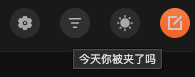
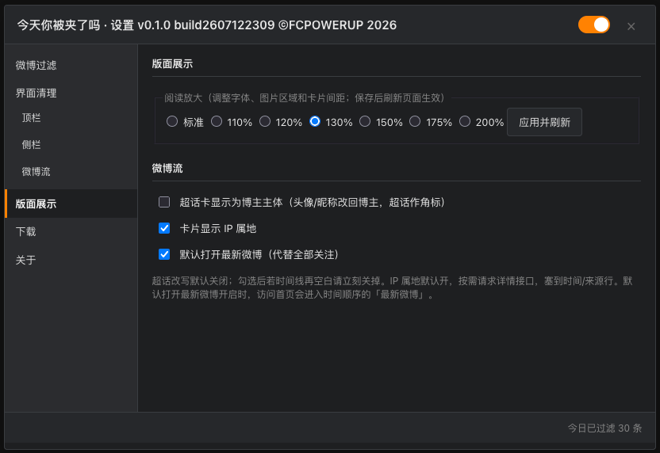

# 今天你被夹了吗

面向微博 Web V7 的宽屏阅读优化油猴脚本。它针对高分辨率宽比例屏幕下信息流卡片偏窄、字体偏小的问题，改善微博的阅读体验。

## 核心功能：阅读放大

在“版面展示”中选择阅读放大比例并应用刷新，可调整信息流卡片的显示宽度、字体和媒体尺寸，让宽屏阅读更舒适。

## 其他功能

- 清理顶部、侧栏和信息流中的干扰内容。
- 按广告、作者 ID、关键词或投票微博过滤信息流。
- 默认打开“最新微博”，支持阅读放大和 IP 属地显示。
- 微博底栏提供收藏、图片下载和视频下载。
- 下载内容按“作者昵称 / 单条微博 ID”自动分目录保存。
- 顶栏“我的收藏”可直达当前账号的收藏页。

## 安装

1. 在浏览器安装 Tampermonkey 或 Violentmonkey。
2. 在本仓库 Releases 下载最新版 `weibo-jiale_v*_build*.user.js`。
3. 打开油猴管理面板，选择“实用工具 / Utilities”→“从文件导入”，选择刚下载的文件并确认安装。
4. 登录 `https://weibo.com`，刷新页面。

安装完成并刷新页面后，微博顶栏会出现“今天你被夹了吗”按钮。点击它可以打开插件设置。

## 使用

- 打开设置后进入“版面展示”，选择阅读放大比例，点击“应用并刷新”。
- 设置窗右上角可开启或关闭全部功能。
- 有图片或视频的微博会在底栏显示下载按钮；收藏按钮位于赞按钮后。

## 当前状态

基础功能已可用。视频画中画使用微博播放器自带按钮，本脚本不接管视频画面点击行为。

## 更新

在设置的“关于”页点击“检查更新”，可查询 GitHub 最新正式版本；发现新版后点击“更新到 vX.Y.Z”，油猴会打开更新确认页。

脚本同时提供油猴标准更新地址。是否自动检查、提示或安装，由 Tampermonkey / Violentmonkey 的更新设置决定。

[查看公开版更新日志](CHANGELOG.md)

## 兼容范围

主要支持桌面版微博 Web V7（`weibo.com`）。微博网页改版后，部分功能可能需要更新脚本。
