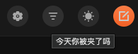
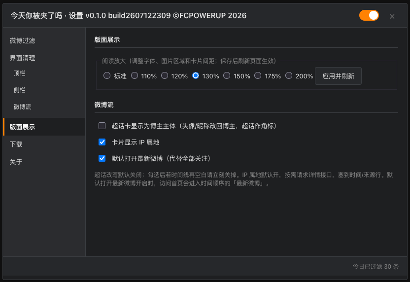
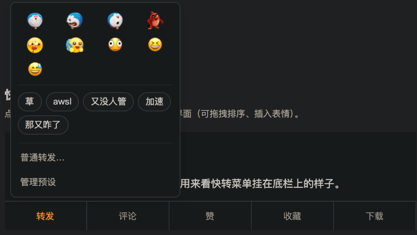

# 今天你被夹了吗

面向微博 Web V7 的宽屏阅读优化油猴脚本。它针对高分辨率宽比例屏幕下信息流卡片偏窄、字体偏小的问题，改善微博的阅读体验。

## 核心功能：阅读放大

在“版面展示”中选择阅读放大比例并应用刷新，可调整信息流卡片的显示宽度、字体和媒体尺寸，让宽屏阅读更舒适。

## 其他功能

- 清理顶部、侧栏和信息流中的干扰内容。
- 按广告、作者 ID、关键词或投票微博过滤信息流。
- 默认打开“最新微博”，支持阅读放大和 IP 属地显示。
- 微博底栏提供收藏、图片下载和视频下载；下载默认取原图 / 最高可下视频。
- 下载内容按“作者昵称 / 单条微博 ID / CDN 原文件名”保存，并会跳过昵称旁的勋章等装饰图。
- 顶栏“我的收藏”可直达当前账号的收藏页。
- 底栏「转发」支持快转预设：点开菜单选表情或短语即可带内容转发，也可管理预设。

## 安装

1. 在浏览器安装 Tampermonkey 或 Violentmonkey。
2. 在本仓库 Releases 下载最新版 `weibo-jiale_v*_build*.user.js`。
3. 打开油猴管理面板，选择“实用工具 / Utilities”→“从文件导入”，选择刚下载的文件并确认安装。
4. 登录 `https://weibo.com`，刷新页面。

安装完成并刷新页面后，微博顶栏会出现“今天你被夹了吗”按钮。点击它可以打开插件设置。

## 使用

- 打开设置后进入“版面展示”，选择阅读放大比例，点击“应用并刷新”。
- 设置窗右上角可开启或关闭全部功能。
- 有图片或视频的微博会在底栏显示下载按钮；收藏按钮位于赞按钮后。
- 点底栏「转发」打开快转菜单：上方为表情格子（悬停显示短语），下方为文本标签；选一条即可转发。菜单底部可「普通转发…」或「管理预设」。

## 黑名单清理

微博黑名单有名额上限，里面常有已经关闭、违规受限或找不到的账号。黑名单清理会逐个检查黑名单里的账号，把这些失效账号批量移出黑名单，腾出名额。

### 扫描

1. 打开微博屏蔽设置页 `https://weibo.com/set/shield`，页面右下角会出现“黑名单清理”面板。
2. 在“扫描进程数”选择同时检查的账号数（1 至 5，默认 1）。数值越大越快，也越容易触发微博的访问验证。
3. 点击“开始扫描”。脚本先读取完整黑名单，再在新标签页逐个打开账号主页判断状态，判断完自动关闭该标签页。扫描期间请保持屏蔽设置页打开。
4. 只屏蔽了对方微博的账号直接保留，不打开主页检查。
5. 可随时点击“暂停扫描”，之后点击“继续扫描”接着检查。进度自动保存在油猴中，刷新页面或重新打开浏览器后可以继续。
6. 出现验证码、“访问频繁”等提示时扫描会停止。在微博完成验证后，点击“继续扫描”即可。

### 检查结果

用面板里的分类下拉框查看结果：

| 分类 | 含义 | 是否清理 |
| --- | --- | --- |
| 自行关闭 | 对方已申请关闭账号 | 可清理 |
| 违规受限 | 对方因违反社区公约无法查看 | 可清理 |
| 等待验证 | 对方账号内容存在风险，验证前无法查看 | 可清理 |
| 昵称无人使用 | 按昵称已找不到该账号 | 可清理 |
| 保留 | 正常拉黑，或只屏蔽了对方微博 | 保留 |
| 检查未完成 | 超时、网络异常等原因未能判断 | 保留，可用“重试未完成”再查 |

读取名单后才改了昵称的账号，也会显示为“昵称无人使用”。

### 清理

1. 清理前建议点击“导出清单 CSV”保存一份记录。账号移出黑名单后，只能在微博上手动重新拉黑。
2. 扫描完成或暂停后，在分类下拉框选择要清理的分类，脚本会自动勾选该分类里可清理的账号；选择“可清理”会勾选上面四类全部账号。也可以逐个勾选或取消。
3. 点击“解除所选屏蔽”，勾选的账号会被逐个移出黑名单，完成后显示“已解除”。
4. 某个账号解除失败或没有收到明确结果时，它会显示“解除待确认”，后面的账号暂停处理，脚本也不会自动重发。可以到微博屏蔽设置页核对，需要时重新勾选后再次解除。

### 新拉黑的账号

扫描完成后又拉黑了新账号时，点击“更多操作”里的“检查黑名单总数”，新账号会加入列表，再点击“继续扫描”只检查这些新账号。

### 其他操作

“更多操作”里还有：

- 重试未完成：重新检查“检查未完成”的账号。
- 清空进度：清除全部扫描结果，之后需要从头扫描；不改变微博上的黑名单。
- 导出日志：遇到问题时导出工作日志，反馈时附上。
- 深色模式：切换面板配色。

扫描进度保存在油猴脚本的存储里。更新脚本时直接覆盖安装即可保留进度；卸载脚本或清除油猴数据会丢失进度。

## 当前状态

基础功能已可用。视频画中画使用微博播放器自带按钮，本脚本不接管视频画面点击行为。

## 更新

在设置的“关于”页点击“检查更新”，可查询 GitHub 最新正式版本；发现新版后点击“更新到 vX.Y.Z”，油猴会打开更新确认页。

脚本同时提供油猴标准更新地址。是否自动检查、提示或安装，由 Tampermonkey / Violentmonkey 的更新设置决定。

[查看公开版更新日志](CHANGELOG.md)

## 兼容范围

主要支持桌面版微博 Web V7（`weibo.com`）。微博网页改版后，部分功能可能需要更新脚本。
